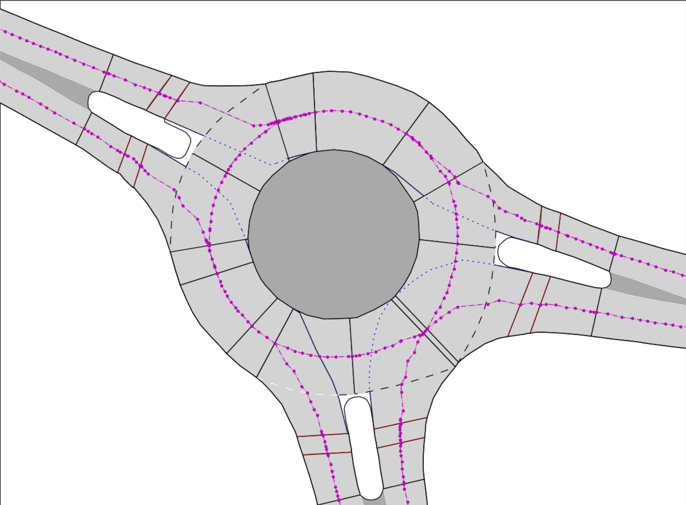
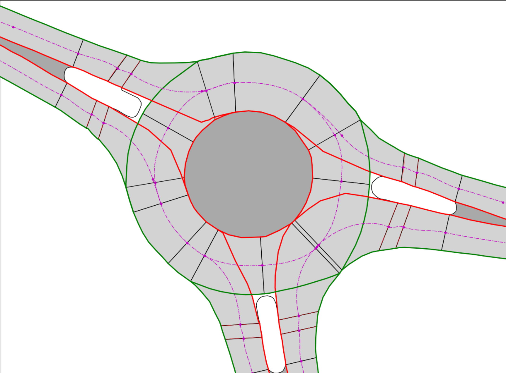
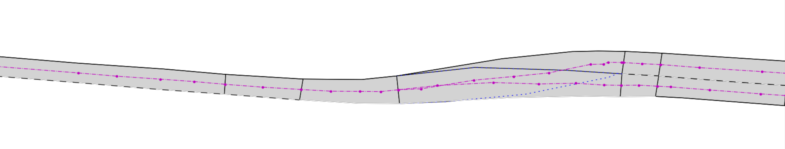
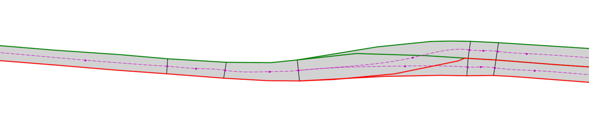
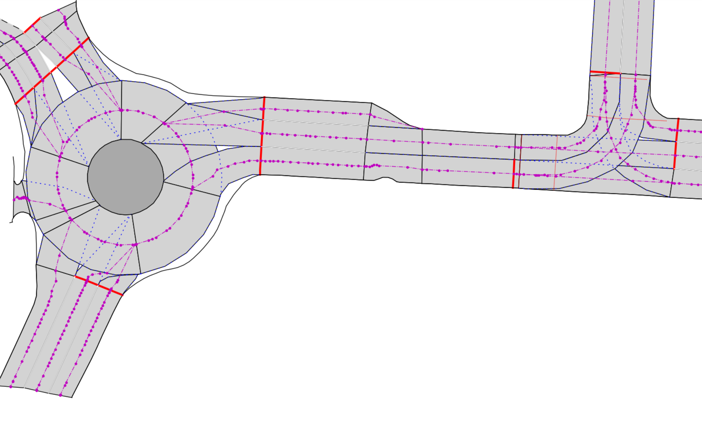
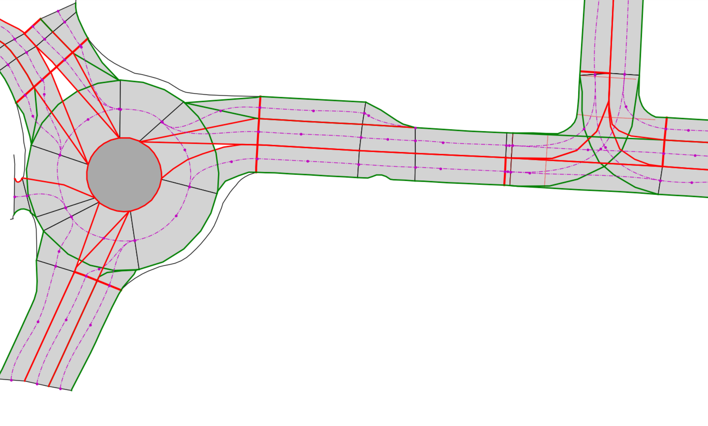
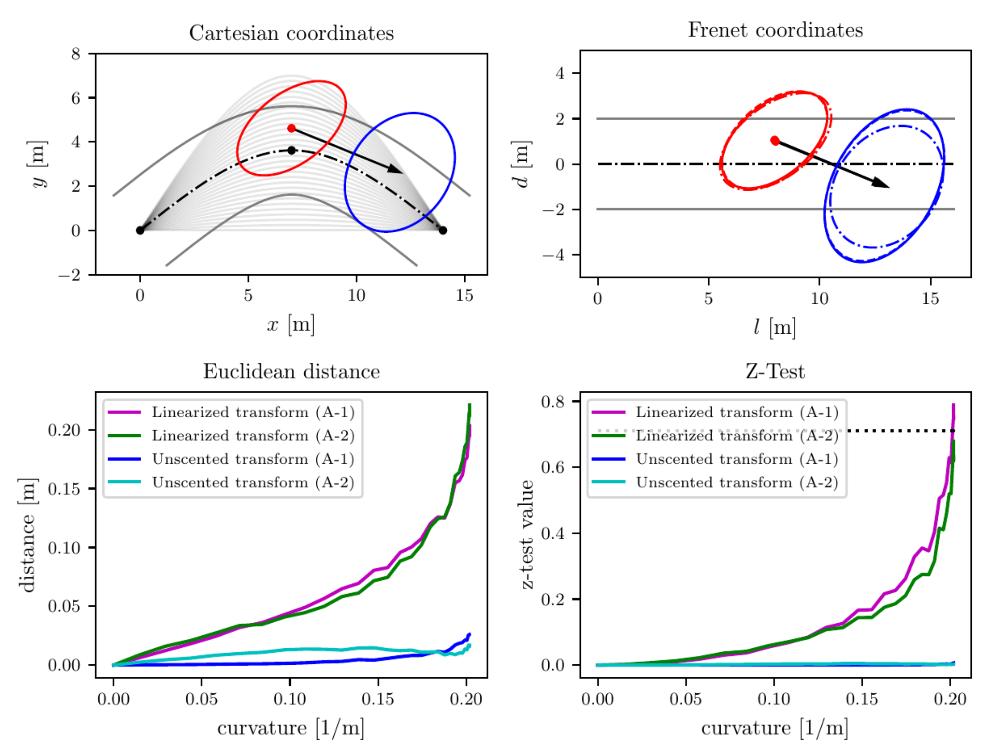

# Corridor

[Travis-CI status](https://travis-ci.com/github/dspetrich/corridor)

[](https://travis-ci.com/dspetrich/corridor)

## Overview

Corridor is a C++ library for creating a curve-based description of a traffic lane segment, utilizing the [Frenet–Serret formulas](https://en.wikipedia.org/wiki/Frenet%E2%80%93Serret_formulas). Such representations can be applied in the context of automated driving to describe traffic situations within the topology of the road network.
The library is designed as an extension to the [lanelet2](https://github.com/fzi-forschungszentrum-informatik/Lanelet2) map library but can potentially be used with any other map format.

### Features
- Creates a **corridor from three 2D polygons**, representing the left and right lane boundary, and the reference line in a Cartesian coordinate frame (e.g. UTM or similar).
- Reference line is converted into a **2D cubic spline**, which serves as reference curve of the Frenet frame. Besides being located between the left and right boundary, no further requirements towards the reference polygon need to be meet (no centerline! no equidistant points!). However, it is recommended that the sampling rate of the polygon is higher in areas with high curvature to ensure good interpolation behavior. All three polygons can have their own sampling rate which can variate, e.g. no equidistant sampling required on any of the three polylines.
- Left and right boundary are directly converted into a Frenet polygon representation, consisting of arc length and deviation with respect to the reference line. This allows an efficient query of the corridor width and signed boundary distances at any query length.
- Consecutive corridors can be combined to a continuos **corridor sequence**, which behaves similar to a single corridor.
- **Utility functions** for coordinate transformations under error propagation for linear and non-linear projection. Build-in projections methods for position and velocity information including the covariance matrix and polar coordinate transformation (particular usefully for velocity information)
- Non-linear projection based on a **generic Unscented Transformation** implementation.
- **Probabilistic assignment functions** for any objects and points to the corridor. This includes relative location and orientation of the object/point to the corridor. Furter information in the documentation:
- **Python** bindings and evaluation scripts for the most important queries.
- [**Detailed technical documentation**](doc/corridor_documentation.pdf) for all algorithms and assumptions. Including evaluation and discussion of all main features.
- Released under the [**BSD 3-Clause license**](LICENSE)

---
## Feature details

### Interactive python scripts
The performance of the corridor library can be tested with some python scripts, located at the [python_api/scripts](python_api/scripts) folder.
The GIF below shows an [interactive script](python_api/scripts/main_corridor_editor.py) to stress the corridor definition and Frenet coordinate transformation. 


In this script all nodes can be dragged and moved around.
In that way either the blue Cartesian position or the shape of the corridor will adapt.
If you click anywhere within the picture, the blue position will jump to it.
In the current implementation only the perpendicular projection, which has the smallest deviation from the reference line, is visualized.
Internally, all projections of the blue point onto the reference line are calculated and can potentially be accessed (or filtered by any other form).

### Corridor definition from lanelet map
When working with real map data some noise in the position of the sample points are unavoidable. This is particularly true for automatically generated center-lines, such as provided by the lanelet2 library.

It is recommended to apply a curve fitting (non-linear regression) before creating a corridor. 
However, when the length of all lane segments are rather short, another, much simpler approach, can be used as well.
As shown in the example pictures below, a smoothening of the resulting reference line can also be archived by reducing the number of sampling points.
Due to the interpolation with cubic splines, each reference line is generated by the start- and end-points of the lane segment as well as their tangents in driving direction. These tangents are determined by the longitudinal lane boundary, indicated by the black lines perpendicular to the reference line.
If the lane segment exceeded 10 meters length, an additional sample point in the middle of the lane segment was used.

Besides much fewer points, which are needed to represent the lane course, it provides also C2 continuity within a corridor/lanelet and C1 continuity between consecutive corridors/lanelets.

The result of this very rudimentary approximation is visualized below. It demonstrates, that despite the more complex cubic representation of the reference line the overall map representation is much simpler.
All pictures are based on map data which is provided by the [INTERACTION dataset](https://interaction-dataset.com/).

Legend:
- reference line (magenta)
- left corridor boundary (red)
- right corridor boundary (green)


| Original data                                                                              | Corridor representation                                                                   |
| ------------------------------------------------------------------------------------------ | ----------------------------------------------------------------------------------------- |
|                |               |
|                   |                  |
|  |  |

### State transformation into Frenet coordinates
The Corridor library provides transformation functions to convert a Cartesian state vector into Frenet coordinates of a corridor.
The originating and resulting states are represented by Gaussian distributions to reflect sensor noise and the error propagation due to the non-linear transformation function.

Two conversion methods are implemented and discussed in the [technical documentation](doc/corridor_documentation.pdf):
- Taylor Series expansion to linearize the transformation function 
- Unscented transformation (generic implementation)
  
The performance of both transformations are evaluated based on two assumptions. Please refer to the technical documentation for more details.



The picture above shows the evaluation of the approximation error of two different error propagation methods, determined at different corridor curvatures in the range of κ ∈
[0, 0.2] 1/m. The upper left picture visualizes the corridor and state in the
Cartesian frame. The red ellipse represents the position uncertainty of three
standard deviations (99.7 %), the black arrow represents the velocity mean vec-
tor and the blue ellipse the velocity uncertainty of three standard deviations.
The gray area visualizes all reference lines of the generated corridors. The upper
right picture displays the transformed state in the Frenet frame of the corridor.
Similar to the Cartesian coordinates, the red and blue ellipses represent the
uncertainty of the position and velocity. The uncertainty ellipses of the ground
truth is shown as solid lines, the linearized transformation as dashed-dot line.
The unscented transformation is represented by a dashed line. The evaluation
of both state transformations compared to the ground truth is shown in the
lower two diagrams. A state transformation approximation is rejected when the
z-test value is above 0.71 (dashed line in the lower right diagram).

### Corridor assignment
Build in algorithms which use the probabilistic Frenet coordinates, represented as Gaussian distribution, to assign detected objects to corridors.

Implemented features:
- **Lateral** and **longitudinal** overlap of the object with the corridor. This is based on the Gaussian distribution of the position estimated and the projection of the estimated object's bounding box. (Details in the )
- **Moving confidence** and **bounding box orientation**.

Details can be found in the [technical documentation](doc/corridor_documentation.pdf). 


## Documentation

You can find a detailed technical description about the Corridor library in this [document](doc/corridor_documentation.pdf).
Don't hesitate to contact me if you have questions about the algorithms and implementation.

---
## Installation

Corridor relies mainly on [Catkin](https://catkin-tools.readthedocs.io/en/latest/index.html) for building and is targeted towards Linux.

At least **C++14** is required.

### Dependencies
Besides [Catkin](https://catkin-tools.readthedocs.io/en/latest/index.html), the dependencies are
* `Boost` (from 1.58)
* `eigen3`
* [`mrt_cmake_modules`](https://github.com/KIT-MRT/mrt_cmake_modules), a CMake helper library
* `boost-python, python2 or python3` (for python_api)

For Ubuntu, the steps are the following:
* [Set up ROS](http://wiki.ros.org/ROS/Installation), and install at least `rospack`, `catkin` and `mrt_cmake_modules` (e.g. `ros-melodic-rospack`, `ros-melodic-catkin`, `ros-melodic-mrt-cmake-modules`):
```
sudo apt-get install ros-melodic-rospack ros-melodic-catkin ros-melodic-mrt-cmake-modules
```

* Install the dependencies above:
```bash
sudo apt-get install libboost-dev libeigen3-dev libpugixml-dev libpython-dev libboost-python-dev python-catkin-tools
```

**On 16.04 and below**, `mrt_cmake_modules` is not available in ROS and you have to clone it into your workspace (`git clone https://github.com/KIT-MRT/mrt_cmake_modules.git`).

### Building
As usual with Catkin, after you have sourced the ros installation, you have to create a workspace and clone all required packages there. Then you can build.
```shell
source /opt/ros/$ROS_DISTRO/setup.bash
mkdir catkin_ws && cd catkin_ws && mkdir src
catkin init
catkin config --cmake-args -DCMAKE_BUILD_TYPE=RelWithDebInfo # build in release mode (or whatever you prefer)
cd src
git clone https://THIS_REPO
cd ..
catkin build
```

### Python3

The python bindings are implemented and tested with python 3. In general it should work with pythion 2.7 and above as well, but I didn't test it yet.

## Citation

If you are using Corridor for scientific research or work, I would be pleased if this  library is mentioned. A scientific publication of this work and its usage is currently in the making and will be mentioned here shortly.


